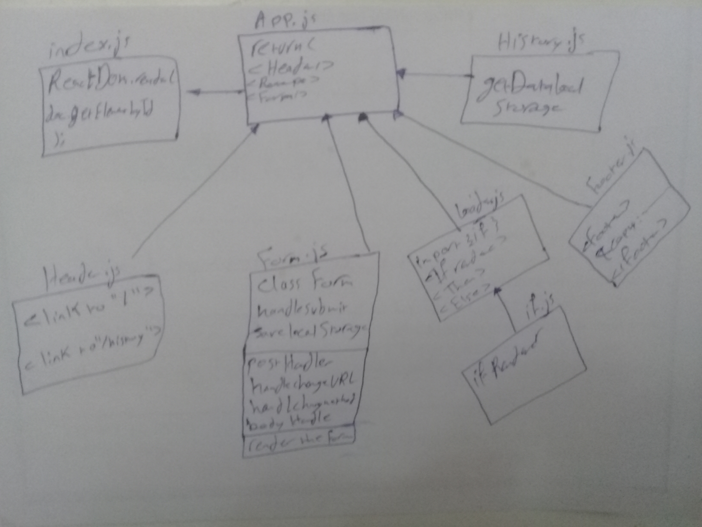

# Project: Component Based UI
**Our application will be an API testing tool that can be run in any browser, allowing a user to easily interact with APIs in a familiar interface.** 

**A browser based API testing tool**

### Author: Hammad Al

## Modules
* index.js
* app.js
* header.js
* footer.js

## Setup
* How to initialize/run your application
* npm run start

## UML

